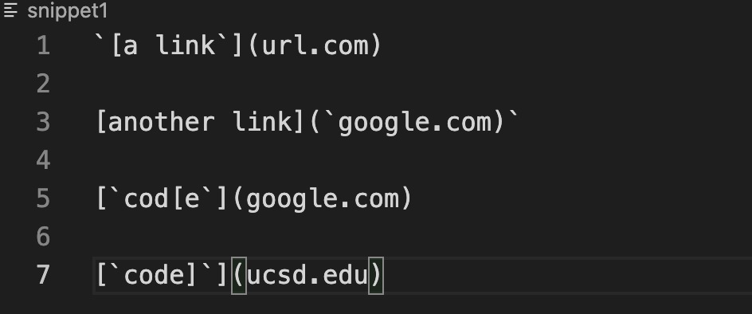
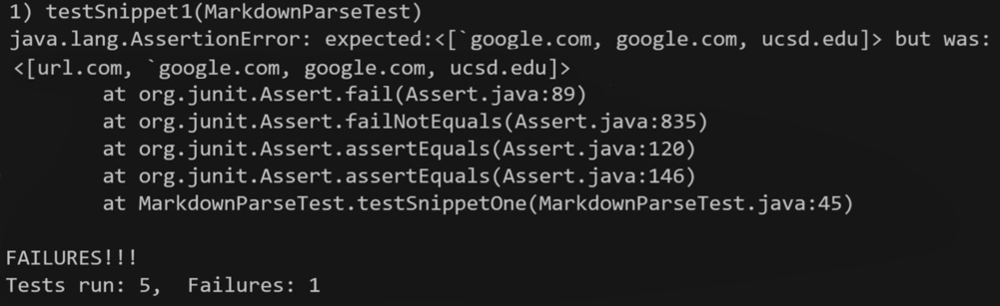
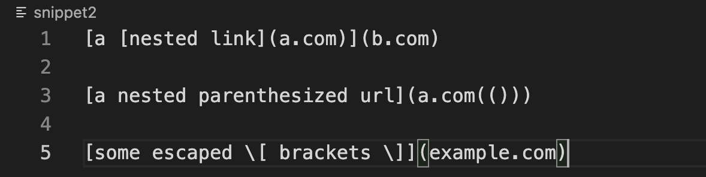
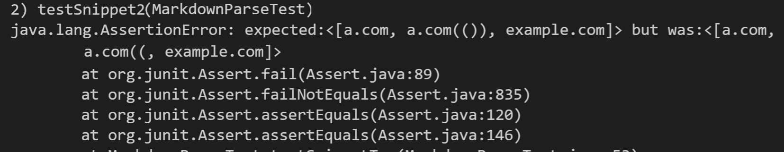
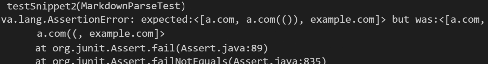
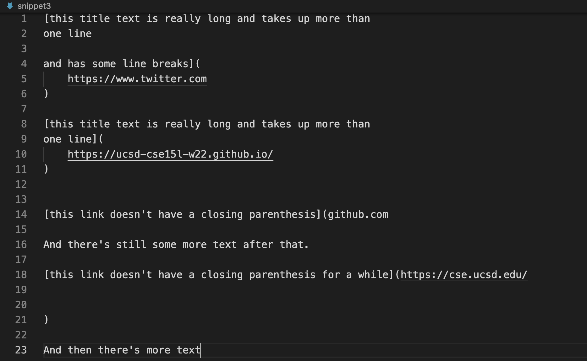
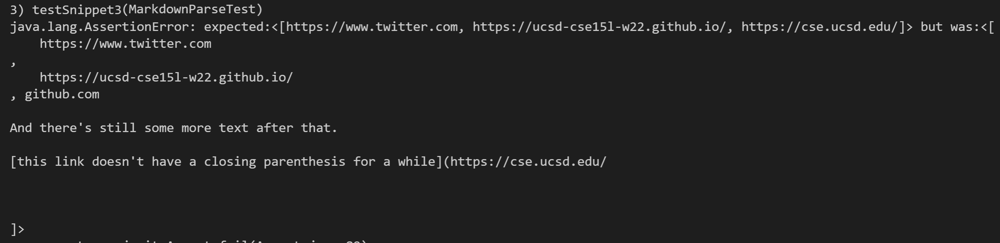

# Lab Report #4


[My MarkdownParse](https://github.com/haowang0716/markdownParse_Original)

[Other group's MarkdownParse(From Ben)](https://github.com/haowang0716/markdown-parse)

## Snippet 1



The expected output is:
```
[`google.com, google.com, ucsd.edu]
```

My output: 


Ben output: 


For this one, I think a small code change would work. I should add an if statement to check if there is another ' in the link after a ' so it is a valid link. 

## Snippet 2

The expected output is:
```
[a.com, a.com(()), example.com]
```


My output: 


Ben output: 


For this snippet, the nested link should not be printed. So I think i should add something such as if the [] is not in pair, I should not print the link. And maybe before an [], ignore the unpaired () from last link. I think these would take more than 10 lines. 

## Snippet 3


The expected output is:
```
[https://www.twitter.com, https://ucsd-cse15l-w22.github.io/, https://cse.ucsd.edu/]
```

My output: 


Ben output: 


I think why my output is so messy right now is because the program do not know how to deal with a lot of spaces and empty lines. I am not sure what to do with this situation. Right now I can only think of tracking all the symbols through lines and print out only the proper links. 
